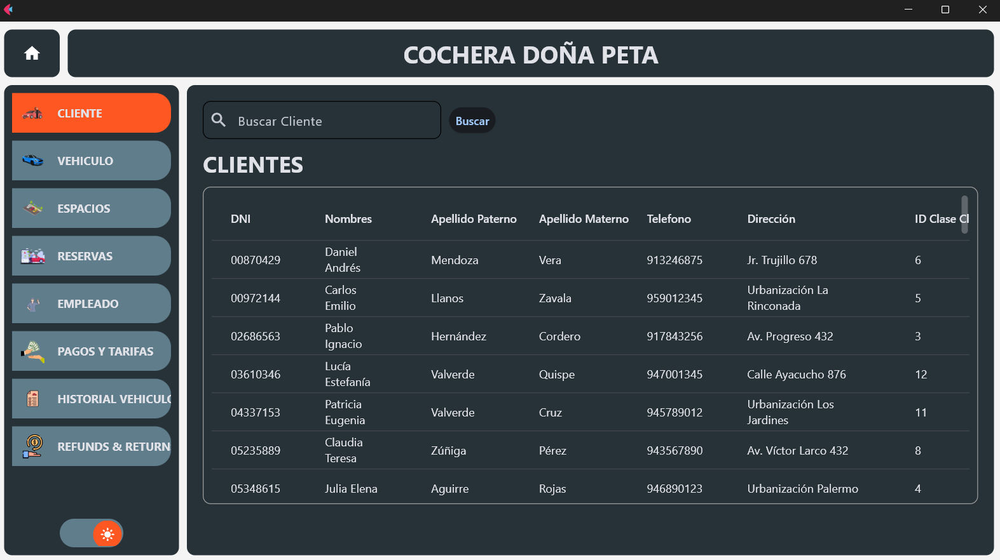

# 🚗 Sistema de Gestión - Cochera Doña Peta

Este proyecto es un sistema de administración para una cochera moderna, llamado **Cochera Doña Peta**. Su núcleo está basado en un **modelo de base de datos diseñado desde cero**, y cuenta con una **interfaz gráfica desarrollada en Python usando Flet**, implementando una arquitectura **MVC (Modelo-Vista-Controlador)** para mantener el código organizado y escalable.

---

## 📂 Estructura del Proyecto

proyectoCochera
├── controllers/ # Lógica de control (intermediarios entre vistas y modelos)
├── models/ # Gestión de datos y conexión a la base de datos MySQL
├── views/ # Interfaces construidas con Flet
├── db_cochera.sql # Modelo relacional de base de datos
└── main.py # Punto de entrada de la aplicación


---

## 🧠 Modelo de Base de Datos

El modelo de datos se diseñó completamente desde cero y está disponible en el archivo `db_cochera.sql`. La base de datos `cochera` incluye las siguientes entidades clave:

- `Cliente`  
- `Vehiculo`  
- `EspacioEstacionamiento`  
- `TipoVehiculo`, `TipoEspacio`, `ClaseCliente`, `TiempoReserva`, `MetodoPago`  
- Relaciones entre clientes, sus vehículos y los espacios que ocupan.  
- Claves foráneas bien definidas y control de integridad referencial.

🛠️ Este modelo busca reflejar escenarios reales de uso para una cochera que clasifica clientes por frecuencia y ofrece espacios con diferentes características.

---

## 🖥️ Interfaz (Flet + MVC)

La interfaz gráfica fue creada con el framework **Flet** para Python. Sus principales funcionalidades son:

- Visualización de las tablas de la base de datos.
- Filtros interactivos por nombre, tipo de cliente, tipo de vehículo, etc.
- Cambios dinámicos de tema claro/oscuro.
- Estructura desacoplada gracias a MVC.

---

## ▶️ Cómo ejecutar

1. Instalar las dependencias necesarias:

```bash
pip install -r requirements.txt 
```

2. Cargar la base de datos ejecutando:

```bash
mysql -u TU_USUARIO -p < db_cochera.sql
```

3. Ejecutar el programa principal:

```bash
flet main.py
```

